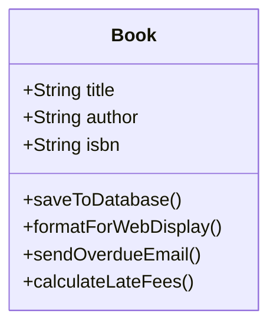
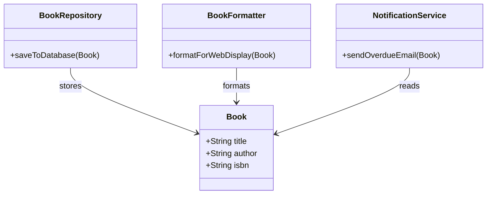

# Lesson 1 — What Is System Architecture?

### Level 1 — Foundations | Module — Foundations

---

## Preamble

Think of a codebase you have worked in that was genuinely hard to understand. Every time you added a feature, something seemingly unrelated broke. The code felt brittle, finding where a specific bug lived took hours, and nobody on the team felt confident making large changes. That friction is not a failure of coding ability; it is a failure of system architecture.

In this course, you are going to build a full-stack framework called Stratum. But before you write a single line of code, you need to understand how to design the system that code will live in. By the end of this lesson, you will be able to distinguish between a system that grew organically and one that was deliberately designed, and you will meet the library system we will use to ground these concepts.

---

## Outcomes

By the end of this lesson you will be able to:

- Define system architecture and explain why it matters before writing code
- Identify the software development lifecycle and where architecture sits within it
- Describe the difference between a system that grew and a system that was designed
- Recognise the library example system that will be used throughout Level 1

---

## Prerequisites

- None — but read [`BEFORE_YOU_BEGIN.md`](./BEFORE_YOU_BEGIN.md)

---

## §1

### What is System Architecture?

When developers talk about building an application, they often jump straight to technology choices: "We are using React for the frontend and Django for the backend."

While important, technology choices are not architecture. **System architecture** is the high-level structure of a software system—the components it is made of, the specific responsibilities of each component, and the rules governing how those components interact.[^1] Architecture is about boundaries and communication.

:::{important}
System architecture is the set of fundamental design decisions about a software system. If a decision is difficult to change later, it is architectural.
:::

## §2

### The SDLC and Technical Debt

Architecture does not happen in a vacuum. It is a specific phase within the **Software Development Lifecycle (SDLC)**.[^2] The SDLC describes the phases a project moves through: Requirements → Design (Architecture) → Implementation (Coding) → Testing → Deployment → Maintenance.

Skipping the design phase inevitably leads to **technical debt**.[^3] Note that technical debt is not the same as a bug. A bug is code that does not work. Technical debt is code that _does_ work, but was written in a way that makes future changes expensive and slow.

:::{note}
**The SDLC in practice**
While the SDLC is often taught as a linear "waterfall," modern teams iterate through these phases continuously. However, even in Agile environments, the _order_ of the phases within a cycle matters. You cannot implement what you have not designed.
:::

## §3

### UML Primer: Reading Structural Diagrams

Throughout this course, we prioritize visualising structure before writing code. We use Unified Modeling Language (UML) and similar diagramming tools to represent concepts. Before we look at our first system design, you need to understand the notation.

In this lesson, we use **Mermaid class diagrams**.

- A **box** represents a discrete component or class.
- The **top section** of the box is the name of the component.
- The **middle section** lists its attributes (the data it holds).
- The **bottom section** lists its methods (the actions it can perform).
- **Arrows** between boxes show relationships and dependencies (e.g., Component A calls Component B).

As we progress through Level 1, we will introduce richer C4 and PlantUML diagrams for higher-level system mapping.

## §4

### Systems That Grow vs. Systems That Are Designed

To see the impact of architectural decisions, we will use a simple, familiar example throughout Level 1: a **Public Library Management System**.

The system needs to manage books, patrons, and the checkout process. Let's look at what happens when a system is coded directly from requirements without an architectural design phase, versus when it is deliberately structured.

#### §4.1 The System That Grew (The God Class)

When developers just start typing, they tend to group everything related to a noun into a single place. The result is a "God class"—a single component doing far too much.

In this system, the `Book` component handles data storage, web presentation, business logic (fees), and external communication (emails). It is highly brittle.

#### §4.2 The System That Was Designed (Separated Concerns)

A designed system applies the principle of **separation of concerns**.[^1] We break the God class apart so that each component has one, clearly defined responsibility.

Here, the `Book` is just data. The storage logic lives in `BookRepository`, the UI logic in `BookFormatter`, and the email logic in `NotificationService`. If the database changes, the UI logic is untouched.

:::{tip}
Architecture is ultimately a communication tool. A well-designed system like the one in [§4.2](https://www.google.com/search?q=%234.2) communicates its intent clearly to the next developer who reads it.
:::

## §5

### Looking Ahead: Patterns and Philosophy

As we expand the library system in the coming lessons, we will name specific design patterns (like the _Factory pattern_ or the _Observer pattern_) as they naturally emerge from our architectural decisions. We will also begin integrating a robust testing philosophy, ensuring that as our system's architecture solidifies, our confidence in its correctness scales alongside it.

---

## Summary

| Concept                | What you learned                                                 | Why it matters                                        |
| ---------------------- | ---------------------------------------------------------------- | ----------------------------------------------------- |
| System architecture    | High-level structure and component boundaries.                   | Prevents brittle, unmaintainable codebases.           |
| SDLC                   | The lifecycle phases of software from conception to maintenance. | Provides the context for when architecture happens.   |
| Technical debt         | The future cost of quick, unstructured coding decisions.         | Explains why systems become hard to change over time. |
| Separation of concerns | Dividing a program into distinct features with little overlap.   | The primary tool for fixing overgrown, messy systems. |

---

## Formative Assessment

### Recall

1.  What is the difference between a bug and technical debt? `[BT2 — Understand]`
2.  In the SDLC, which phase must occur immediately before implementation (coding)? `[BT1 — Remember]`

### Application / Reflection

3.  Look at the "God class" diagram in [§4.1](https://www.google.com/search?q=%234.1). If the library decides to switch from sending overdue emails to sending overdue SMS text messages, why does the `Book` class need to be modified? Why is this architecturally problematic? `[BT3 — Apply]`

📋 Memorandum — check your answers here

:::{caution}
Attempt all questions honestly before opening this memorandum.
Self-marking without attempting is not self-marking — it is reading.
:::

---

### Question 1 — Recall (2 marks) `[BT2 — Understand]`

**Correct answer:**
A bug is code that does not function correctly or produces an error. Technical debt is code that functions perfectly well, but is structured poorly, making future changes expensive, risky, and slow.

**Source:** [L01 §2](https://www.google.com/search?q=%232) — "The SDLC and Technical Debt"

**Common mistakes:**
| Mistake | Why it is wrong | Diagnostic note |
|---|---|---|
| Equating technical debt to broken code | Technical debt often passes all tests and works perfectly for the end user. | Suggests misunderstanding of structural cost vs functional correctness — revisit [L01 §2](https://www.google.com/search?q=%232) |

---

### Question 2 — Recall (1 mark) `[BT1 — Remember]`

**Correct answer:**
The Design (Architecture) phase.

**Source:** [L01 §2](https://www.google.com/search?q=%232) — "The SDLC and Technical Debt"

---

### Question 3 — Application / Reflection (5 marks) `[BT3 — Apply]`

**Rubric:**

| Criterion                          | Marks | Full marks                                                                                                                                                                                                                   | Partial marks                                                                                                   | No marks                                           |
| ---------------------------------- | ----- | ---------------------------------------------------------------------------------------------------------------------------------------------------------------------------------------------------------------------------- | --------------------------------------------------------------------------------------------------------------- | -------------------------------------------------- |
| Identifies the direct cause        | 2     | Correctly notes that `sendOverdueEmail()` is hardcoded inside the Book class itself, so changing the medium (SMS) requires editing the Book component.                                                                       | Notes the Book class must change, but does not identify the specific method responsible.                        | Fails to identify that the Book class must change. |
| Explains the architectural problem | 3     | Explains that this violates separation of concerns. Changing communication infrastructure (SMS) shouldn't require opening a core data entity file, risking accidental breakage to unrelated methods (like `saveToDatabase`). | Identifies it is messy or bad practice, but misses the core concept of separation of concerns and blast radius. | Does not address the architectural implications.   |

**Source:** [L01 §4.1](https://www.google.com/search?q=%234.1) — "The System That Grew (The God Class)"  
**Source:** [L01 §4.2](https://www.google.com/search?q=%234.2) — "The System That Was Designed (Separated Concerns)"

:::{note}
This question assesses quality of reasoning, not correctness of conclusion. A well-argued case for a non-optimal solution scores higher than a correct answer stated without justification.
:::

**Anchor examples:**

- **Strong answer (5/5):** The `Book` class contains the `sendOverdueEmail` method. To change to SMS, we have to edit the `Book` class. This is problematic because it violates separation of concerns; updating how we notify patrons shouldn't require us to touch the file that defines what a book is. We risk breaking database saving or fee calculation by mistake.
- **Weak answer (2/5):** The Book class has an email method so we have to delete it and make an SMS method. It's bad because the Book class is too big.

---

**Your score: \_\_\_ / 8 marks**
**Suggested threshold: 5.5 marks before proceeding**

If you scored below the threshold, review the diagnostic notes above before continuing to the next lesson.

---

## Key Terms

- **system architecture**: The high-level structure of a software system — its components, their responsibilities, and how they interact
- **SDLC**: Software Development Lifecycle — the phases a software project moves through from conception to deployment
- **technical debt**: The implied cost of future rework caused by choosing a quick solution now
- **coupling**: The degree to which one component depends on another
- **cohesion**: The degree to which the elements within a component belong together
- **separation of concerns**: The principle that each component should have one clearly defined responsibility

---

## What's Next

Now that you understand the difference between a system that grew and a system that was designed, we need to formalize how to evaluate those designs. In [Lesson 2](https://www.google.com/search?q=./L02.md), we will dive deeper into "Separation of Concerns" and introduce the metrics of _Coupling_ and _Cohesion_ to measure the health of our architecture.

---

## References

[^1]: Dijkstra, Edsger W. "On the Role of Scientific Thought." _Selected Writings on Computing_, 1982.
